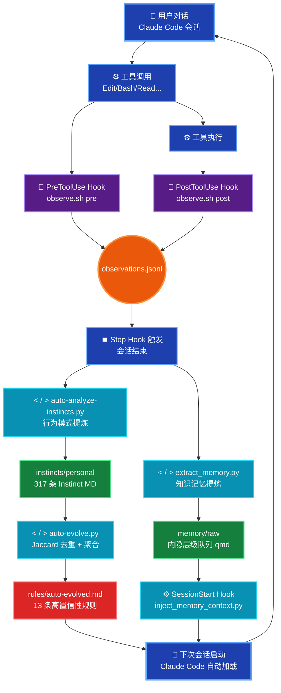

# Claude Code 自我进化和学习系统

## 1. 背景

每次打开 Claude Code 开始新对话，它都是一张白纸。昨天你花了 10 分钟解释的项目架构、你反复纠正的代码风格偏好、你建立的特殊开发规范——全部归零。但是使用过 OpenClaw 和 Hermes 的同学都知道，这 2 个 agent 具备持久化记忆系统，这让我开始思考：能不能给 Claude Code 装上一套"长期记忆"系统？更进一步，不只是被动记忆，而是主动学习：观察我的行为模式、项目架构，提炼行为规律、项目知识，下次自动应用。这就是本文要介绍的系统。

## 2. 系统架构总览

整个系统由三个核心子系统构成：

- 行为观测层（Observation Engine）
- 模式提炼层（Instinct Engine）
- 记忆注入层（Memory Engine）

通过各个子系统协作，形成一个完整的自学习闭环：





## 3. 行为观测层

Observation Engine 通过 Hook 机制 100% 捕获每次工具调用，写入 JSONL 观测流，是整个系统的数据源。H

### Hook 机制——确定性触发的关键

Hook 是 Claude Code 在工具调用生命周期中的回调点，可以通过 Claudecode CLI 执行 /hooks 命令获取。


配置在 ~/.claude/settings.json：
```json
{
  "hooks": {
    "PreToolUse": [
      {
        "matcher": "Bash",
        "hooks": [
          {
            "type": "command",
            "command": "~/.claude/hooks/observe.sh pre"
          }
        ]
      }
    ],
    "PostToolUse": [
      {
        "matcher": ".*",
        "hooks": [
          {
            "type": "command",
            "command": "~/.claude/hooks/observe.sh post"
          }
        ]
      }
    ],
    "Stop": [
      {
        "hooks": [
          {
            "type": "command",
            "command": "~/.claude/bin/auto-analyze-instincts.py && ~/.claude/bin/auto-evolve.py"
          }
        ]
      }
    ]
  }
}
```

关键设计：
- Stop Hook 在会话结束时触发，驱动分析和提炼流程。
- PostToolUse 匹配所有工具（.*），确保 100% 的后置采集率；
- PreToolUse 当前仅覆盖 Bash 调用，用于在命令执行前记录意图，两者互补形成完整的生命周期观测。

Observation 数据格式每条观测记录是一个 JSONL 行，包含工具名称、时间戳、输入参数等：

```json
{
  "session_id": "abc123",
  "ts": "2026-05-26T10:30:00Z",
  "phase": "post",
  "tool": "Edit",
  "input": { "file_path": "/src/app.ts", "old_string": "...", "new_string": "..." },
  "bash_desc": null
}
```

当前系统已积累数万条观测记录，约 4MB 数据，记录了跨越数月的完整编程行为轨迹。


### 数据分片与生命周期管理

为防止数据膨胀，observations_rotate.py 在文件超 5MB 或 8000 行时自动按月份分片归档，主文件只保留最近 30 天的数据。


## 模式提炼层

Instinct Engine 会话结束时自动分析观测数据，提炼行为模式为原子化 Instinct 规则，置信度动态演化。这是整个系统最核心的部分。auto-analyze-instincts.py 在每次会话结束时运行，通过两条并行路径提炼行为模式。


